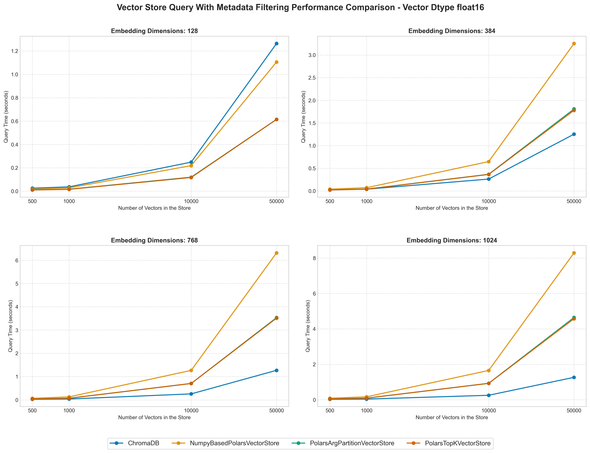

# Polars Vector Store

This repository explores a simple yet fascinating idea: can [Polars](https://pola.rs/) be used as a [vector store](https://en.wikipedia.org/wiki/Vector_database)?

We all know Polars for what it is: an incredibly fast Dataframe library, with a well structured API and a clean, polished syntax. But can it be more that?

The goal of this project is to investigate whether Polars can serve as vector store, by leveraging:

- its [native integration with numpy](https://docs.pola.rs/user-guide/expressions/numpy-functions/), to compute embeddings similarity directly on the dataframe.
- its comprehensive [expressions](https://docs.pola.rs/user-guide/expressions/) framework, to implement a comprehensive metadata filtering system.
- its [lazy api](https://docs.pola.rs/user-guide/lazy-api/), for performance optimization.

To explore this, I've built three different implementations, each taking a unique approach to the problem. You can find more details in the [Implementation details](#implementation-details) section below.

## Summary of Findings

The conclusions are straightforward:

- Yes, Polars can be used as a vector store!

- No, Polars cannot compete with real vector stores, at least in terms of performance (which is what matters the most, after all).

This should not come as a surprise: vector stores use highly optimized data structures and algorithms tailored for vector operations, while Polars is designed to serve a much broader scope. 

However, Polars can still be a viable alternative for small datasets  (up to ~5K vectors), especially when complex metadata filtering is required. For more insights, see the [Benchmark](#benchmark) section below.

## Repository Structure

The repository was created from this [template](https://github.com/GiovanniGiacometti/python-repo-template).  Follow its README instructions to get the project up and running.

### Directory Overview

- 📁 `polars_vector_store`: the juice of the project, it contains different implementations of Polars as a vector store, along with a ChromaDB wrapper for comparison.
- 📁 `notebooks`: Jupyter notebooks for testing and quick benchmarking.
- 📁 `tests`: unit tests for validating the implementations.
- 🗃️ `benchmark.py`: code used for benchmarking the implementations.

## Implementation details

The idea behind the project comes from this [blog post](https://minimaxir.com/2025/02/embeddings-parquet/). 

The general approach is:

- Store embeddings and metadata in a Parquet file.
- Load the data into a Polars DataFrame.
- Query the DataFrame to get the closest embeddings to a given query vector, optionally filtering some metadata.

### Basic Usage

```python

# PolarsVectorStore is an abstract class, you should use one of the implementations
polars_vector_store = PolarsVectorStore(ParquetLoader("path/to/parquet_file"))

# query without metadata filtering
closest_k = polars_vector_store.similarity_search_by_vector(
    query,
    k,
)

# query with metadata filtering
# metadata_filter can be any Polars expression!
closest_k_with_metadata = polars_vector_store.similarity_search_by_vector(
    query,
    k,
    metadata_filter=pl.Expr(...)
)

```

Both `closest_k` and `closest_k_with_metadata` are Polars DataFrame, containing the information of the closest `k` vectors to the query vector.

This approach is particularly useful if your data is already stored in a Parquet file and you need to perform some complex metadata filtering alongside similarity search.

### Implementations

I’ve explored three different implementations. I'll describe them here, but you can find the code in the `polars_vector_store/polars` folder. Notice that all implementations rely on embedding being normalized, so that the similarity can be computed using the dot product.

1. `NumpyBasedPolarsVectorStore`: 
    - Extracts the embedding column as a NumPy array.
    - Computes the similarity using NumPy.
    - Sorts results using NumPy’s argpartition for efficiency (again, shoutout to the blog post).
    - ✅ Fastest implementation (when filtering is not requested)
    - ❌ Requires loading all embeddings into memory, making it impractical for large datasets.

2. `PolarsTopKVectorStore`: 
    - Computes the similarity directly within the DataFrame.
    - Sorts results using Polars `top_k` function.
    - ✅ Avoids materializing large DataFrames early.

3. `PolarsArgPartitionVectorStore`:
    - Identical to the previous implementation but uses the [`arg_partition` plugin](https://github.com/GiovanniGiacometti/polars-argpartition) to sort the similarities.
    - ✅ *Should* be more efficient than the previous implementation, as a full sort is not performed.

The most critical con of all these implementations is however the same: they are not as fast as a real vector store.

## Benchmark

A simple benchmark was conducted to compare the performance of the different implementations against a real vector store, [ChromaDB](https://docs.trychroma.com/docs/overview/introduction). ChromaDB was set up with default values, though further optimization is possible — refer to the [ChromaDB documentation](https://docs.trychroma.com/docs/collections/configure) for details.

The benchmarking code, available in `benchmark.py`, runs as part of a GitHub action and commits results to the `benchmark_results` folder.

### Benchmark Methodology

The benchmark measures the time required to perform a similarity search on a dataset under three scenarios:

- Querying the vector store without metadata filtering.
- Querying while filtering on a single metadata column.
- Querying while filtering on all three metadata columns in the dataset.

These tests are repeated across varying parameters:
- **Dataset size**: Ranges from 500 to 50000 vectors (limited by GitHub Actions’ free-tier memory constraints, particularly for ChromaDB, whose setup requires high memory).
- **Embedding dimensions**: from 128 to 1024.
- **Vector data type**: float16 or float32.

Results are stored as CSV files in the  `benchmark_results` folderfolder and a Jupyter notebook (`4-visualize-benchmark-results.ipynb`) in `notebooks` was used to produce some analysis plots.

### Results

#### Query time without metadata filtering


Observations:
- ChromaDB is almost instantaneous, while all Polars implementations show linear performance degradation as dataset size increases. The NumPy-based approach is the fastest among them but still lags behind ChromaDB.
- No significant difference is observed between the `top_k` and `argpartition` Polars-based methods. The similarity computation, rather than sorting, appears to be the main bottleneck.
- Polars implementations slow down as embedding dimensions increase, whereas ChromaDB remains unaffected.

#### Query time with one metadata filtering



Observations:

- ChromaDB remains the fastest but slows down as dataset size increases. Interestingly, it performs poorly with 128-dimensional embeddings, likely due to some internal issues worth investigating.
- Polars implementations show **no significant increase** in query time when filtering metadata, which shows one of the main advantages of using Polars as a vector store, especially when metadata filtering is required.
- The NumPy-based approach, however, slows considerably with metadata filtering. I'm not entirely sure why this is the case, it might be that the other implementations are able to leverage some Polars optimizations that this approach (that materializes the dataframe and then converts it back to a DataFrame) cannot.

## Contributing

Contributions are welcome! If you have ideas for optimizing the Polars code, feel free to open an issue or submit a pull request — I’d love to discuss improvements
